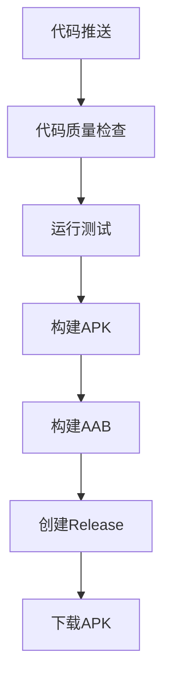

---
AIGC:
    ContentProducer: Minimax Agent AI
    ContentPropagator: Minimax Agent AI
    Label: AIGC
    ProduceID: "00000000000000000000000000000000"
    PropagateID: "00000000000000000000000000000000"
    ReservedCode1: 3046022100de5028194c8b8294906640cad854cbb73055d748e41b3762bc9d856179be111d022100dc86fe0ab81aeab4d6d7e63d9607bc5fcf3c51135bd69f9a76fe6f58911c8196
    ReservedCode2: 304502202e783493c08e6b67a97196998b0d8c858b1db5107e539f33aa2b57c578d687f4022100b86d825032cd5c9fb69a8b44760eee0034451d54726c1d41a041429112d835e0
---

# 🚀 GitHub Actions 完整部署方案

## 📋 概述

即刻AI助手项目已配置完整的GitHub Actions自动化部署系统，支持：
- ✅ **自动构建**: 推送代码自动构建APK
- ✅ **多架构支持**: arm64-v8a、armeabi-v7a
- ✅ **代码质量检查**: 静态分析、测试覆盖率
- ✅ **自动发布**: 构建成功自动创建Release
- ✅ **安全签名**: APK数字签名

## 🗂️ 文件结构

```
workspace/
├── .github/workflows/          # GitHub Actions配置
│   ├── build-apk.yml          # 主要构建流程
│   ├── compatibility-test.yml  # 兼容性测试
│   ├── security-scan.yml       # 安全扫描
│   ├── dependency-update.yml   # 依赖更新检查
│   └── performance-test.yml    # 性能测试
├── GitHub_Actions部署指南.md     # 详细部署指南
├── GitHub_Actions快速部署.md     # 快速开始指南
├── deploy-to-github.sh         # Linux/Mac部署脚本
└── deploy-to-github.bat        # Windows部署脚本
```

## ⚡ 快速部署（推荐）

### 方法一：使用自动脚本

#### Linux/Mac用户
```bash
# 1. 给脚本执行权限
chmod +x deploy-to-github.sh

# 2. 运行部署脚本
./deploy-to-github.sh
```

#### Windows用户
```cmd
# 1. 双击运行
deploy-to-github.bat

# 2. 或在命令行中运行
deploy-to-github.bat
```

### 方法二：手动部署

#### 第1步：创建GitHub仓库
1. 访问 [GitHub.com](https://github.com)
2. 创建新仓库：`jike-ai-agent`

#### 第2步：配置GitHub Secrets

在仓库的 **Settings** → **Secrets and variables** → **Actions** 中添加：

| 密钥名 | 说明 | 获取方法 |
|-------|------|----------|
| `SIGNING_KEY` | APK签名密钥 | `base64 -i jike-release-key.keystore` |
| `STORE_PASSWORD` | 密钥库密码 | 生成密钥时设置的密码 |
| `KEY_ALIAS` | 密钥别名 | `jike-key-alias` |
| `KEY_PASSWORD` | 密钥密码 | 生成密钥时设置的密码 |

#### 第3步：推送代码
```bash
git init
git add .
git commit -m "即刻AI助手 - 初始提交"
git branch -M main
git remote add origin https://github.com/你的用户名/jike-ai-agent.git
git push -u origin main
```

## 🔧 详细配置说明

### 构建流程



### 触发条件

| 事件 | 分支 | 动作 |
|------|------|------|
| `git push` | `main` | 构建Release版本 + 创建Release |
| `git push` | `develop` | 构建Debug版本 + Firebase分发 |
| `Pull Request` | `main` | 仅测试构建 |
| `手动触发` | 任意 | 可选择构建类型 |

### 构建产物

| 文件类型 | 架构 | 文件名 | 说明 |
|---------|------|-------|------|
| APK | arm64-v8a | `app-arm64-release.apk` | 64位Android设备 |
| APK | armeabi-v7a | `app-armeabi-release.apk` | 32位Android设备 |
| AAB | 通用 | `app-release.aab` | Google Play发布 |

## 📊 工作流详解

### build-apk.yml 主要阶段

1. **🔍 代码质量检查**
   - `flutter analyze` 静态代码分析
   - 测试覆盖率统计
   - 代码规范检查

2. **🧪 运行测试**
   - 单元测试：`flutter test`
   - 集成测试：`flutter test integration_test`

3. **📱 构建APK**
   - 多架构并行构建
   - 自动APK签名
   - 产物上传

4. **🎉 创建Release**
   - 自动生成版本号
   - 创建GitHub Release
   - 附上构建产物

## 🛠️ 故障排除

### 常见问题

#### 1. 签名失败
**错误信息**: `Signing key not found`
**解决方案**: 检查`SIGNING_KEY`是否正确设置为base64格式

#### 2. 依赖下载失败  
**错误信息**: `pub get failed with 1 error`
**解决方案**: 检查`pubspec.yaml`依赖版本兼容性

#### 3. 构建超时
**错误信息**: `The operation was canceled`
**解决方案**: 优化构建脚本或增加超时时间

### 调试技巧

1. **查看详细日志**
   - 进入Actions页面 → 点击具体workflow → 查看步骤日志

2. **手动触发构建**
   - Actions页面 → "Run workflow" → 选择调试模式

3. **缓存依赖**
   ```yaml
   - uses: actions/cache@v3
     with:
       path: ~/.pub-cache
       key: ${{ runner.os }}-pub-${{ hashFiles('**/pubspec.lock') }}
   ```

## 📈 性能优化

### 加速构建

1. **启用依赖缓存**
2. **并行构建架构**
3. **增量构建**
4. **优化Flutter版本**

### 减少存储空间

```yaml
# 清理构建文件
- name: Cleanup
  run: |
    rm -rf jike_ai_agent/.dart_tool
    rm -rf jike_ai_agent/build
```

## 🔐 安全最佳实践

### 密钥管理
- ✅ 使用GitHub Secrets存储敏感信息
- ✅ 定期轮换签名密钥
- ✅ 限制Secrets访问权限

### 代码安全
- ✅ 启用依赖漏洞扫描
- ✅ 定期更新依赖版本
- ✅ 审查第三方依赖

## 📋 检查清单

部署前确认：

- [ ] GitHub仓库已创建
- [ ] 所有Secrets已正确配置
- [ ] 项目文件结构完整
- [ ] GitHub Actions权限正确
- [ ] 签名密钥已生成
- [ ] 本地测试通过

## 🎯 下一步优化

1. **监控告警**: 设置构建失败通知
2. **性能监控**: 集成构建时间统计
3. **安全扫描**: 添加自动化安全检查
4. **多环境**: 配置staging、production
5. **用户反馈**: 集成测试分发系统

## 🔗 相关链接

- **GitHub Actions文档**: https://docs.github.com/en/actions
- **Flutter构建**: https://docs.flutter.dev/deployment/android
- **Android签名**: https://developer.android.com/studio/publish/app-signing
- **项目仓库**: [你的GitHub仓库地址]

---

## 🎉 总结

即刻AI助手项目已配置完整的GitHub Actions自动化部署系统，实现：

- 🚀 **一键部署**: 推送代码自动构建APK
- 📱 **多架构支持**: 覆盖主流Android设备
- 🔄 **持续集成**: 每次代码变更自动测试
- 🎯 **自动发布**: 构建成功自动创建Release
- 🛡️ **安全可靠**: 代码质量检查 + 安全扫描

**立即开始部署您的AI助手应用吧！** 🚀
